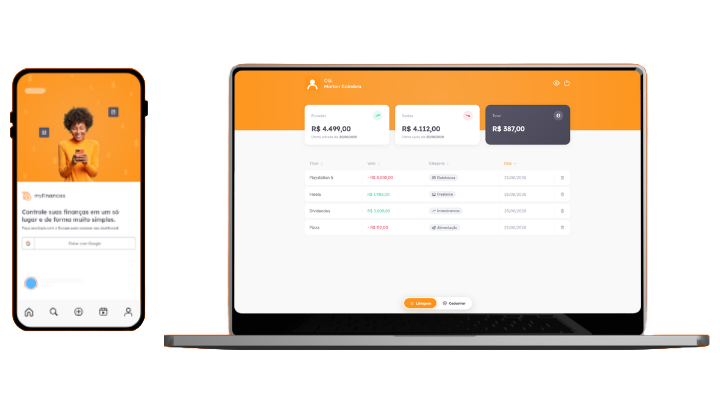

<h1 align="center" style="font-weight: bold;">myFinances 💰</h1>

<p align="center">
  
  
  
</p>

<p align="center">
 <a href="#layout">Layout</a> •
 <a href="#features">Features</a> •
 <a href="#technologies">Technologies</a> •
 <a href="#colors">Colors</a> •
 <a href="#started">Getting Started</a> •
 <a href="#usage">Usage</a> •
 <a href="#routes">Routes</a> •
 <a href="#roadmap">Roadmap</a> •
 <a href="#colab">Collaborators</a> •
 <a href="#license">License</a>
</p>

<p align="center">
    <b>myFinances is a simple and elegant Progressive Web App to track your personal finances. Register income and expenses, organize transactions by category, and keep a clear overview of your balance.</b>
</p>

<p align="center">
    The app uses Google authentication and stores data in Firebase Realtime Database, so your transactions stay synced across sessions.
</p>

<p align="center">
     <a href="https://myfinances-ten.vercel.app">📱 Visit this Project</a>
</p>

<h2 id="layout">🎨 Layout</h2>

<p align="center">
    
</p>

<h2 id="features">✨ Features</h2>

- Sign in with Google
- Register income and expense transactions
- Organize transactions by category
- Financial summary with income, expenses, and balance
- Delete transactions with confirmation modal
- Responsive layout for desktop and mobile
- Toast notifications for user feedback

<h2 id="technologies">💻 Technologies</h2>

**Client (Web)**

- [TypeScript](https://www.typescriptlang.org/)
- [React](https://reactjs.org/)
- [Create React App](https://create-react-app.dev/)
- [SASS](https://sass-lang.com/)
- [Formik](https://formik.org/)
- [Yup](https://github.com/jquense/yup)
- [Framer Motion](https://www.framer.com/motion/)
- [React Router](https://reactrouter.com/)
- [Firebase Authentication](https://firebase.google.com/docs/auth)
- [Firebase Realtime Database](https://firebase.google.com/docs/database)

<h2 id="colors">🎨 Color Palette</h2>

| Color | Preview | Hex |
| ----- | ------- | --- |
| Background |  | `#F9F9F9` |
| Card |  | `#FFFFFF` |
| Brand Orange |  | `#FF941A` |
| Title |  | `#585666` |
| Body Text |  | `#969CB2` |
| Income Green |  | `#33CC95` |
| Expense Red |  | `#E52E4D` |

<h2 id="started">🚀 Getting started</h2>

<h3>Cloning</h3>

```bash
git clone https://github.com/MarlonVictor/myFinances.git
cd myFinances
```

<h3>Environment Variables</h3>

Copy the example file and fill in your Firebase configuration:

```bash
cp .env.example .env.local
```

| Variable | Description |
| -------- | ----------- |
| `REACT_APP_API_KEY` | Firebase API key |
| `REACT_APP_AUTH_DOMAIN` | Firebase authentication domain |
| `REACT_APP_DATABASE_URL` | Firebase Realtime Database URL |
| `REACT_APP_PROJECT_ID` | Firebase project ID |
| `REACT_APP_STORAGE_BUCKET` | Firebase storage bucket |
| `REACT_APP_MESSAGING_SENDER_ID` | Firebase Cloud Messaging sender ID |
| `REACT_APP_APP_ID` | Firebase app ID |

<h3>Installation</h3>

```bash
yarn install
```

<h3>Starting</h3>

```bash
yarn start
```

Open [http://localhost:3000](http://localhost:3000) in your browser.

<h3>Deployment</h3>

The app is deployed at [https://myfinances-ten.vercel.app](https://myfinances-ten.vercel.app).

To build for production:

```bash
yarn build
```

The output is generated in the `build/` folder and can be served by any static hosting provider.

<h2 id="usage">👀 Usage</h2>

1. Sign in with your Google account.
2. Add income or expense transactions with a title, amount, category, and date.
3. Review the summary cards for total income, expenses, and balance.
4. Browse and delete transactions from the transactions table.

<div id="routes"></div>

## 📍 Application Routes

| route | description |
|----------------------|-----------------------------------------------------|
| <kbd>/</kbd> | Sign-in page with Google authentication |
| <kbd>/home</kbd> | Dashboard with summary, new transaction form, and transactions table |
| <kbd>/*</kbd> | 404 not found page |

## 📍 Firebase Data Structure

| path | description |
|----------------------|-----------------------------------------------------|
| <kbd>users/{userId}</kbd> | User profile and nested transactions |
| <kbd>users/{userId}/transactions/{transactionId}</kbd> | Single transaction (`name`, `type`, `price`, `category`, `createdAt`) |

<h2 id="roadmap">🧭 Roadmap</h2>

* [x] Google authentication
* [x] Income and expense tracking
* [x] Category-based organization
* [x] Financial summary dashboard

<h2 id="colab">🤝 Collaborators</h2>

<table>
  <tr>
    <td align="center">
      <a href="https://github.com/MarlonVictor">
        <br>
        <sub>
          <b>Marlon Victor</b>
        </sub>
      </a>
    </td>
  </tr>
</table>

<h2 id="contribute">🤝 Contribute</h2>

Contributions are always welcome!

1. Fork the project
2. Create your feature branch (`git checkout -b feature/amazing-feature`)
3. Commit your changes (`git commit -m 'Add amazing feature'`)
4. Push to the branch (`git push origin feature/amazing-feature`)
5. Open a Pull Request

<h2 id="license">License 📃</h2>

This project is under [MIT](./LICENSE) license.
